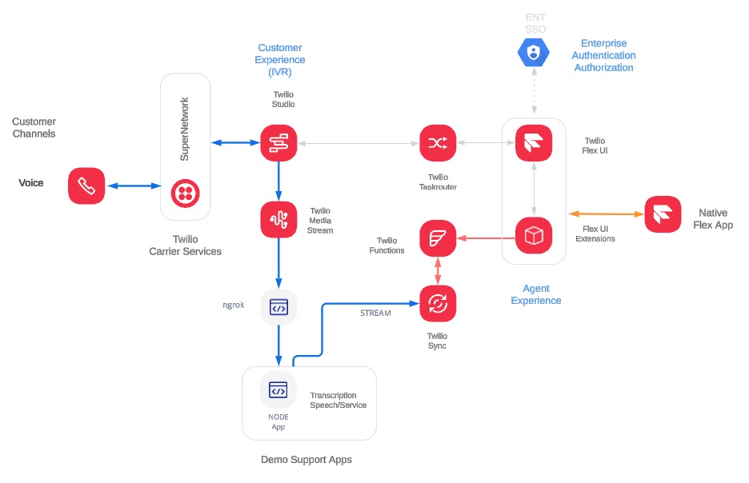
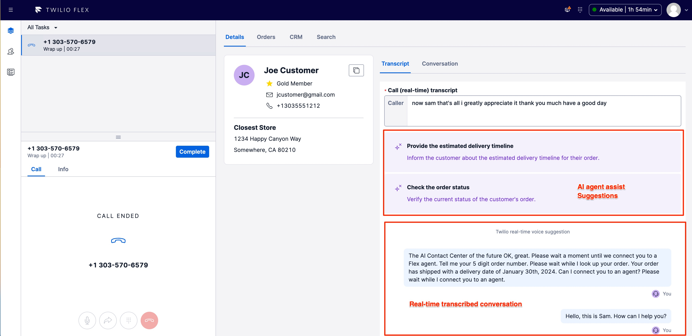

# SKO 2024 Flex Transcription and AI Suggestions Demo

This repository contains several componenet deployments to use in for demonstrating real-time voice transcription with AI suggestions to the agent based on conversation between the customer and agent.

The following elements and their file/folder location (parathensis), are part of this demonstration:

1. Flex Plugin (src) - Custom UI interface that summarized the Customer data and more.
2. Studio Voice Flow (studio) - This is raw JSON for the inbound Studio flow and must be imported into the Flex account.
3. Serverless Package (serverless) - This serverless package contains a single Twilio Function that is called by the Flex Plugin
4. Real-Time Transcription App - This is a node package that interacts with the Twilio Media Stream, Microsoft Speech Service and Twilio Sync Stream.

### Demonstration Architecture

The following image hightlight the architecture of this demonstation and the components above.



### Screenshots - Transcription and AI Suggestions
This screenshot illustrates the agent experience with real-time transcription of the 'customer/agent' conversation.  "Agent Assist" capabilites are displayed to the agent as well to aid in solving the customer's inquiry.



## Setup

The following steps are necessary to use this plugin package.  These are:

1. Real-time Transcription Engine (apps/transcriptionEngine): Setup/Configure
2. Plugin Serverless (apps/serverless) - Setup & Configure
3. Import Studio Flow (app/studio)
4. Flex Plugin (src) - Setup & Configure

### Real-time Transcription Engine - Setup/Configure
This package is located within 'apps/transcriptionEngine'. Follow the README instructions inclusive to this package.

After setup and configuration, run this app ( node index.js ) to launch the service on port 8080.

### Plugin Serverless - Setup/Configure
This package is located within 'apps/serverless'. Follow the README instructions inclusive to this package.

After setup and configuration, launch the serverless ( twilio serverless:start ) to run locally on port 3000.

### Import Studio Flow
This package is located within 'apps/studio'. Within Twilio Studio, create a "New Flow" and import the JSON (copy/paste) from this resource. After your flow is imported, make the following changes:

1. Update the StreamInbound widget to include the Ngrok URL from your transcriptionEngine service.
1. Update the Workflow setting on the "Send to Flex" widget to "Assign to Anyone".
1. Update Task Channel setting on the "Send to Flex Widget" to "Default".
1. You can also update the "Attributes" field with customer attributes to suit your demo needs.
1. Republish your flow.

### Flex Plugin - Setup and Configure

The following steps are necessary to configure and test the Flex Plugin found in `/src`.

1. Configure .env file
```sh
cp .env.example .env
```

2. Copy public/appConfig.example.js to appConfig.js

```sh
cp appConfig.example.js appConfig.js
```

3. Swich to the `src` directory: `cd /src`

4. Build the package dependencies.

```sh
npm i
```

3. Install necessary pre-requisites ( [Twilio CLI](https://www.twilio.com/docs/twilio-cli/getting-started/install), [Flex Plugins CLI](https://www.twilio.com/docs/flex/developer/plugins/cli) & [Twilio Serverless Toolkit](https://www.twilio.com/docs/labs/serverless-toolkit) )

5. From the CLI, Create a Twilio [account profile](https://www.twilio.com/docs/twilio-cli/general-usage/profiles) and mark it [active](https://www.twilio.com/docs/twilio-cli/general-usage/profiles#set-an-active-profile)


6. Launch the Flex Plugin

While logged into the Twilio Flex account via Twilio Console, launch the Flex Plugin on port 3001.

```sh
twilio flex:plugins:start
```
